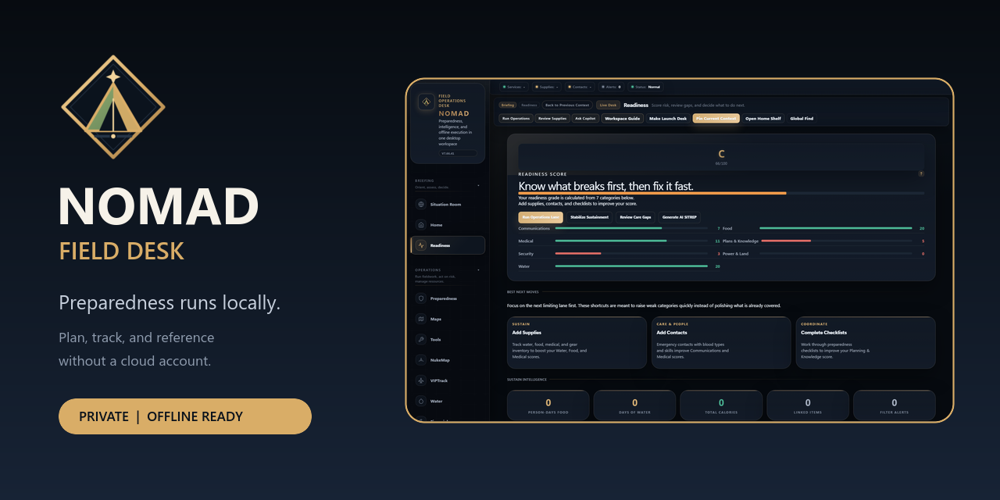
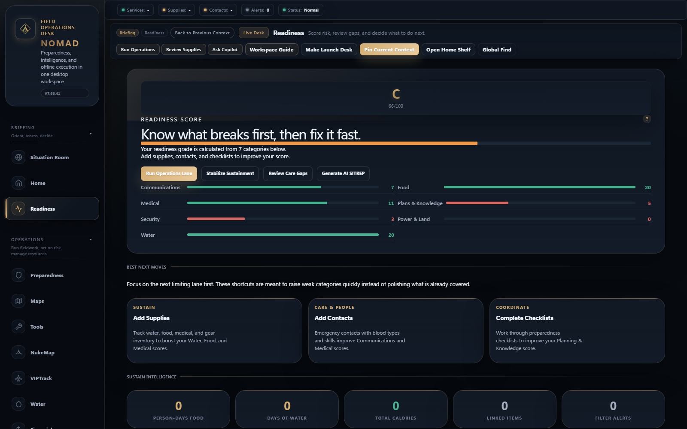
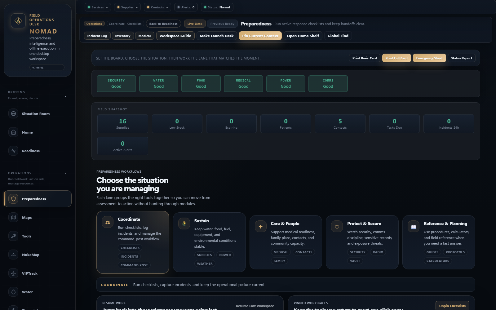
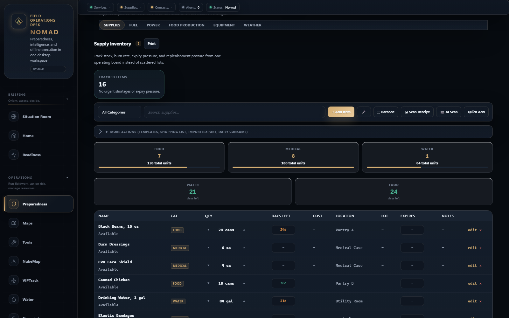
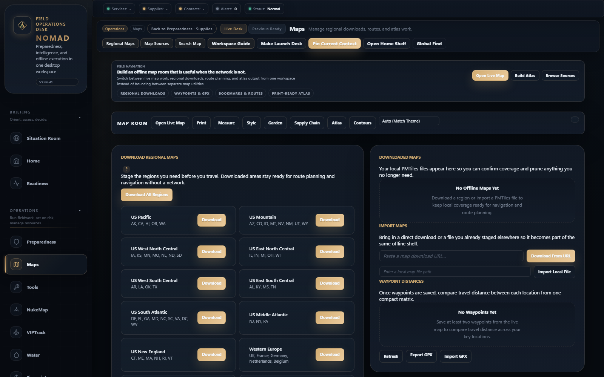
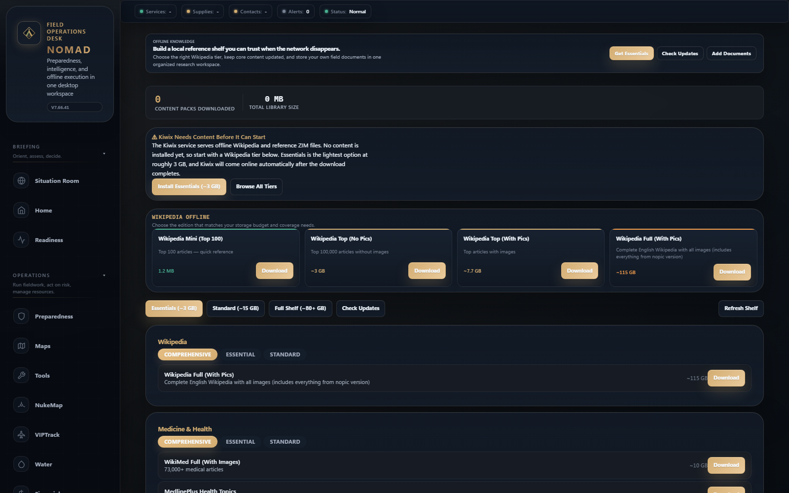

# NOMAD Field Desk v7.66.41

**A local-first desktop workspace for preparedness, field operations, and offline reference.**

[](https://github.com/SysAdminDoc/project-nomad-desktop/releases/latest)
[](LICENSE)
[](#install)
[](#privacy-and-safety)

NOMAD turns scattered spreadsheets, bookmarks, and emergency notes into one private field desk. Track supplies. Measure readiness. Stage maps and reference material before the network disappears. Your operational data stays on your machine.

[Download the latest release](https://github.com/SysAdminDoc/project-nomad-desktop/releases/latest) | [Read the safety notes](#privacy-and-safety) | [Build from source](#build-from-source)



## See the real app

These captures come from the shipping interface at 1600 by 1000 pixels. The readiness and inventory views use representative data created in a disposable local profile. They aren't mockups, and no personal data is included.

| Readiness board | Field workflows |
|:---:|:---:|
| [](docs/media/readiness-dashboard.png) | [](docs/media/preparedness-workflows.png) |
| **Inventory planning** | **Offline maps** |
| [](docs/media/inventory-planning.png) | [](docs/media/offline-maps.png) |

[](docs/media/offline-library.png)

## Why people use it

- Keep household plans, contacts, medical notes, and supply records together.
- Work from downloaded maps and reference libraries when connectivity is poor.
- Run checklists, incident logs, handoffs, and printable reports from one desk.
- Add a private local assistant with Ollama when your hardware and use case call for it.

NOMAD is useful before an incident too. Its readiness score shows weak categories, inventory burn rates expose shortages, and the library helps turn a spare drive into a searchable reference shelf.

## What is inside

| Workspace | What it does |
|:---|:---|
| **Readiness** | Scores water, food, medical, communications, security, power, and planning data. Weak categories lead to the records that need attention. |
| **Preparedness** | Groups checklists, incidents, contacts, supplies, medical records, radio tools, and planning references into operating lanes. |
| **Supply desk** | Tracks quantities, locations, minimums, expiration dates, and daily use. It also calculates days remaining and shopping gaps. |
| **Maps** | Downloads regional map packages, imports PMTiles, stores waypoints and routes, and exports GPX. A print-ready atlas works without a live map service. |
| **Library** | Manages Kiwix ZIM files, local PDFs, EPUB books, and text notes. Content tiers make storage needs visible before download. |
| **Local assistant** | Connects to Ollama and optional Qdrant collections. Conversations and indexed documents remain on the local system. |
| **Situation Room** | Collects public weather, hazard, market, and news feeds when a connection is available. Recent data is cached for later review. |
| **Field output** | Produces contact sheets, status reports, checklists, GPX data, CSV exports, and other portable formats. |

The navigation is organized by task so the supporting modules don't have to compete for attention at once.

| Supporting area | Included tools |
|:---|:---|
| **Coordination** | Briefings, alert rules, exercises, federation, group ops, and interoperability |
| **People and supplies** | Comms, kit builder, loadout planning, meal planning, nutrition, and daily living |
| **Property and awareness** | Water planning, vehicles, agriculture, power, threat intel, OPSEC, hardware sensors, and specialized modules |
| **Reference work** | Training, notes, media, calculators, and import or export tools |

## Offline means something specific

NOMAD keeps its application database and settings locally. Core records remain available without an account or internet connection.

| Available offline | Needs a connection at least once |
|:---|:---|
| Inventory, contacts, checklists, notes, and local reports | Downloading optional services and content packs |
| Previously downloaded maps, routes, and waypoints | Fetching a new regional map package |
| Installed Kiwix libraries and local documents | Downloading an Ollama model or Kiwix ZIM file |
| Calculators and stored operational history | Refreshing live alerts, news, markets, or weather |

Download what you need before travel or a planned outage. Live sources cannot update while the network is down, and cached information can become stale.

## Install

### Windows

The current release is built and checked on Windows 11.

1. Open the [latest release](https://github.com/SysAdminDoc/project-nomad-desktop/releases/latest).
2. Choose `NOMAD-Setup.exe` for a normal install, or `NOMADFieldDesk-Windows.exe` for the portable build.
3. Compare the file against `SHA256SUMS.txt` when it is provided.
4. Start NOMAD, choose a data location, then add only the optional content you want.

The current Windows artifacts are not code signed. Windows may show a SmartScreen warning, so verify the SHA-256 checksum before running either file.

The portable executable can live on a removable drive. Keep a separate backup of the data directory if that drive contains records you cannot replace.

### Linux and macOS

The source supports Linux and macOS through Python and pywebview. Release binaries must be built on their target operating system, so the newest GitHub release may not include both platforms. See [Build from source](#build-from-source) for the current code.

On Ubuntu and related distributions, install the WebKit bindings first:

```bash
sudo apt install python3-gi gir1.2-webkit2-4.1
```

## First run

NOMAD opens a setup guide instead of downloading a large stack automatically. Pick a storage location, then choose the services and reference tiers that fit the machine.

Good first steps:

1. Add household contacts and blood types you are comfortable storing locally.
2. Record water, food, and medical supplies with minimum quantities.
3. Complete one readiness checklist and review the score.
4. Download the map regions and reference packs you expect to need offline.

Optional downloads range from a small starter shelf to hundreds of gigabytes. The setup screen shows estimated size before anything starts.

## Optional local services

NOMAD can install and manage these services when the current platform supports them. None is required for basic records or planning.

| Service | Adds |
|:---|:---|
| [Ollama](https://ollama.com/) | Local language models |
| [Qdrant](https://qdrant.tech/) | Vector search for document collections |
| [Kiwix](https://www.kiwix.org/) | Offline Wikipedia and ZIM libraries |
| [CyberChef](https://gchq.github.io/CyberChef/) | Data conversion and analysis tools |
| [Kolibri](https://learningequality.org/kolibri/) | Offline learning content |
| [Stirling PDF](https://www.stirlingpdf.com/) | Local PDF operations |
| [FlatNotes](https://github.com/dullage/flatnotes) | A focused Markdown notebook |
| BitTorrent support | Resumable distribution for large public data packs |

Service state, storage, and logs are visible in the app. When upstream publishers provide checksums, NOMAD verifies downloads before use.

## Privacy and safety

NOMAD binds to localhost by default. It has no required cloud account and does not add telemetry to your records.

If you make it available on a LAN:

- Set `NOMAD_AUTH_REQUIRED=1`.
- Set `NOMAD_ALLOWED_HOSTS` to the host names you will use.
- Put remote access behind TLS and an authenticating reverse proxy.
- Never expose the built-in server directly to the public internet.

Preparedness records can be sensitive. Protect the Windows account, encrypt removable storage where appropriate, and test backups before relying on them.

NOMAD is an organizational aid, not an emergency dispatch system. Hazard feeds may be delayed. Medical, radio, navigation, and safety references do not replace current instructions from qualified professionals or public authorities. Confirm critical decisions through an authoritative source whenever one is available.

## Data and portability

The main database is SQLite in WAL mode. Uploaded documents, map packages, backups, and managed service files live under the selected data directory.

Common exchanges include CSV, vCard, GPX, GeoJSON, KML, iCalendar, CHIRP radio CSV, ADIF, FHIR R4, JSON, and Markdown. Exact fields vary by workspace. Export a small sample before moving a large collection into another tool.

## Build from source

You need Python 3.10 or newer and a current Node.js LTS release. Python 3.12 is used for release verification.

### Windows PowerShell

```powershell
git clone https://github.com/SysAdminDoc/project-nomad-desktop.git
cd project-nomad-desktop
python -m venv .venv
.venv\Scripts\python -m pip install -r requirements.txt -r requirements-dev.txt
npm ci
npm run build
.venv\Scripts\python nomad.py
```

### Linux or macOS

```bash
git clone https://github.com/SysAdminDoc/project-nomad-desktop.git
cd project-nomad-desktop
python3 -m venv .venv
.venv/bin/python -m pip install -r requirements.txt -r requirements-dev.txt
npm ci
npm run build
.venv/bin/python nomad.py
```

### Local verification

```powershell
npx playwright install chromium
npm test
.venv\Scripts\python -m pytest tests -q --timeout=120 --timeout-method=thread
npm run visual:test
npm run marketing:capture
powershell -ExecutionPolicy Bypass -File tools\build_brand_assets.ps1
powershell -ExecutionPolicy Bypass -File tools\build_marketing_assets.ps1
.venv\Scripts\python tools\release.py
```

`npm run marketing:capture` starts a loopback-only server with a temporary data directory, adds representative sample records, captures the five README images in headless Chromium, then removes the temporary profile. It never opens the desktop window or reads a user's NOMAD database.

Set `NOMAD_CAPTURE_BASE_URL` and `NOMAD_CAPTURE_ISOLATED=1` to capture a running packaged build. Use that mode only with a disposable profile because the script adds representative records before taking screenshots.

The two image-building scripts require ImageMagick 7 and its `magick` command. They are only needed when regenerating brand or marketing artwork.

## Project layout

```text
nomad.py                 Desktop entry point and pywebview host
web/                     Flask routes, templates, browser assets, and PWA files
services/                Optional local service managers
db.py                    Connection pool and database access
db_schema.py             Schema and migration definitions
db_seeds.py              Built-in reference data
tests/                   Python, browser, and JavaScript checks
tools/release.py         Local PyInstaller release pipeline
installer.iss            Windows installer definition
```

The browser interface is served only by the local Flask process. pywebview hosts that interface as a desktop window. Frontend assets are bundled with esbuild, while PyInstaller produces the portable executable.

## Contributing

Bug reports should include the operating system, NOMAD version, failing workspace, and the smallest safe log excerpt that reproduces the problem. Remove personal records, paths, tokens, and local network details before attaching a log.

Keep changes focused. Run the Python and JavaScript checks locally, exercise the affected screen, and include a new product capture whenever the interface changes.

## Credits

NOMAD Field Desk builds on ideas and components from [Project N.O.M.A.D.](https://github.com/Crosstalk-Solutions/project-nomad) by Crosstalk Solutions. The desktop field-desk edition is maintained by [SysAdminDoc](https://github.com/SysAdminDoc).

Third-party services remain the work of their respective maintainers and keep their own licenses. Review those terms before redistributing a bundle that includes optional service binaries or data.

## License

This repository is available under the [MIT License](LICENSE).
